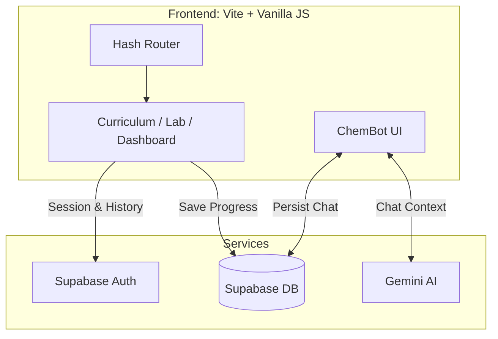

# ChemLab-AI (Virtual Chemistry Lab)

An AI-powered Virtual Chemistry Lab designed for Hong Kong Form 1-3 students. Built with Vite and Vanilla JS, it offers interactive curriculum materials, virtual lab simulations, automated assessments, and a persistent "ChemBot AI" tutor powered by Google Gemini.

## 🎯 Purpose
To provide an accessible, engaging, and interactive platform for learning chemistry. The AI tutor guides students through experiments and curriculum, remembering past interactions to offer personalized help.

## 📸 Architecture & Workflow



## ✨ Features
*   **ChemBot AI:** A smart, persistent AI lab assistant powered by Gemini.
*   **Interactive Curriculum:** Structured lessons aligned with Hong Kong Form 1-3 standards.
*   **Virtual Labs:** Integrates PhET simulations for safe, hands-on learning.
*   **Assessments & Dashboard:** Tracks student progress and scores securely.
*   **No Heavy Frameworks:** Built fast and lightweight using Vanilla JS, DOM manipulation, and Vite.

## 🛠️ Tech Stack
*   **Frontend Engine:** Vite, Vanilla JS
*   **Styling:** CSS (Custom variables, responsive design)
*   **Backend/Auth:** Supabase (PostgreSQL, GoTrue)
*   **AI Integration:** Google Gemini (`@google/generative-ai` via API)

## ⚙️ Setup & Installation

### Prerequisites
*   Node.js (v18+)
*   A [Google Gemini API Key](https://aistudio.google.com/)
*   A [Supabase](https://supabase.com/) project

### 1. Clone the repository
```bash
git clone https://github.com/12345Shahid/kong.git
cd kong
```

### 2. Install dependencies
```bash
npm install
```

### 3. Environment Variables
Copy `.env.example` to `.env` and configure it:
```bash
cp .env.example .env
```
*   `VITE_GEMINI_API_KEY`: Your Google Gemini API Key.
*   `VITE_SUPABASE_URL`: Your Supabase project URL.
*   `VITE_SUPABASE_ANON_KEY`: Your Supabase public Anon key.

### 4. Database Setup
Run the SQL files in the `sql/` directory within your Supabase SQL Editor in numerical order (SQL1 to SQL6) to setup the schema, policies, and seed data.

### 5. Run Locally
```bash
npm run dev
```
Open `http://localhost:5173` to access the lab.

## ⚠️ Known Limitations
*   **Client-Side AI Calls:** API calls to Gemini are made directly from the client. In a production environment, this should be proxied through a backend to protect the API key.

## 🔮 Future Improvements
*   [ ] Build a small Node.js proxy to secure the Gemini API key.
*   [ ] Add multiplayer / classroom collaboration features via Supabase Realtime.

---
*Created by [Shahid](https://github.com/12345Shahid)*
